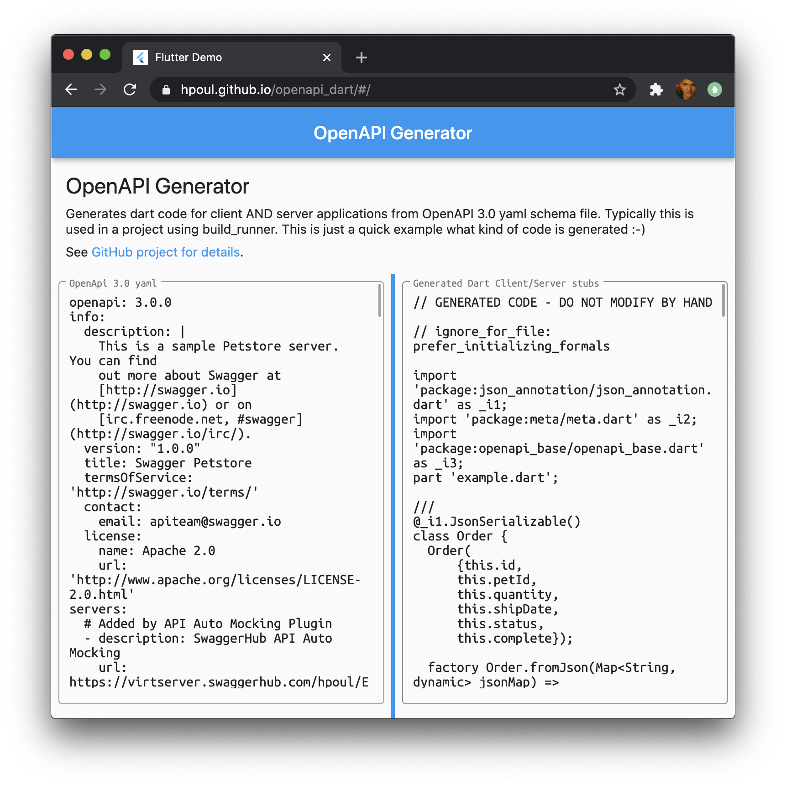
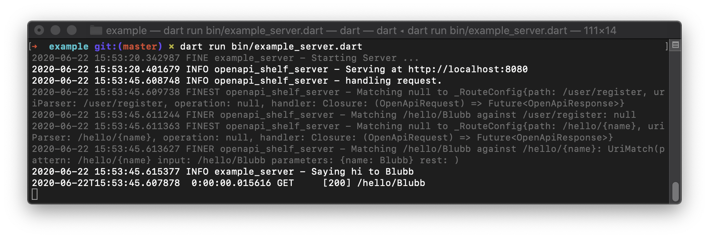
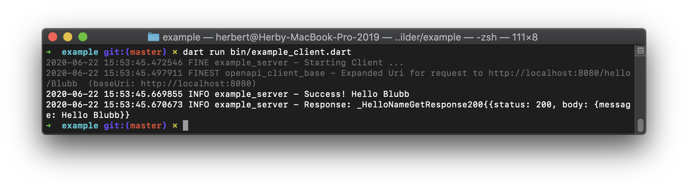

# Dart OpenApi Code Genenrator

`openapi_code_builder` generates server stubs and client libraries for open api schema yaml files.

This is a `build_runner` library meant to be included in the
`dev_dependencies` of your project to allow generating of
dart source files for client and server stubs for
OpenAPI 3.0 schema files (Only yaml is supported right now).

See [directory for an example usage](example/).

You can also [try out the code generator
right inside your browser](https://hpoul.github.io/openapi_dart/): https://hpoul.github.io/openapi_dart/



# Real world example

See the backend for [AuthPass](https://authpass.app/) which uses auto generated
openapi basically as http server. [Yaml file available on github](https://github.com/authpass/authpass-cloud/blob/master/packages/authpass_cloud_shared/lib/src/api/authpass_cloud.openapi.yaml).

# Usage

1. Update `pubspec.yaml`:
   ```yaml
    dependencies:
      json_annotation: ^3.0.1
      openapi_base: any

    dev_dependencies:
      openapi_code_builder: any
      json_serializable: ^3.3.0
      build_runner: ^1.10.0
   ```
2. Create your schema file into your `lib` folder
   with the extension `.openapi.yaml`
3. Optional: Add the base name to your schema
   ```yaml
   openapi: 3.0.0
   info:
     x-dart-name: MyApiName
   ```
4. Run the build_runner:
   ```shell
   (flutter) pub run build_runner build --delete-conflicting-outputs
   ```
5. Implement the server and client. (see below)


# Example schema

```yaml
openapi: 3.0.0
info:
  version: 0.1.0
  title: Example API
  x-dart-name: TestApi

paths:
  /hello/{name}:
    parameters:
      - name: name
        in: path
        required: true
        schema:
          type: string
    get:
      summary: Say Hello World to {name}
      responses:
        '200':
          description: OK
          content:
            application/json:
              schema:
                $ref: '#/components/schemas/HelloResponse'
components:
  schemas:
    HelloResponse:
      properties:
        message:
          type: string
          description: 'The Hello World greeting ;-)'

```

# Implement Server

```dart
class TestApiImpl extends TestApi {
  @override
  Future<HelloNameGetResponse> helloNameGet({String name}) async {
    _logger.info('Saying hi to $name');
    return HelloNameGetResponse.response200(
        HelloResponse(message: 'Hello $name'));
  }
}
```

## Create a server and bind it to a port

```dart
Future<void> main() async {
  PrintAppender.setupLogging();
  _logger.fine('Starting Server ...');
  final server = OpenApiShelfServer(
    TestApiRouter(ApiEndpointProvider.static(TestApiImpl())),
  );
  server.startServer();
}
```

# Implement Client

```dart
Future<void> main() async {
  final requestSender = HttpRequestSender();
  final client = TestApiClient(
      Uri.parse('http://localhost:8000'),
      requestSender);
  final blubb = await client.helloNameGet(name: 'Blubb');
  blubb.map(
    on200: (response) => _logger.info('Success: ****${response.body.message}'),
  );
  _logger.info('Response: $blubb');
  requestSender.dispose();
}
```

# Try it out

Run in `openapi_dart/packages/openapi_code_builder/example`

## Server

```shell
dart run bin/example_server.dart
```



## Client

```shell
dart run bin/example_client.dart
```


